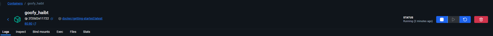
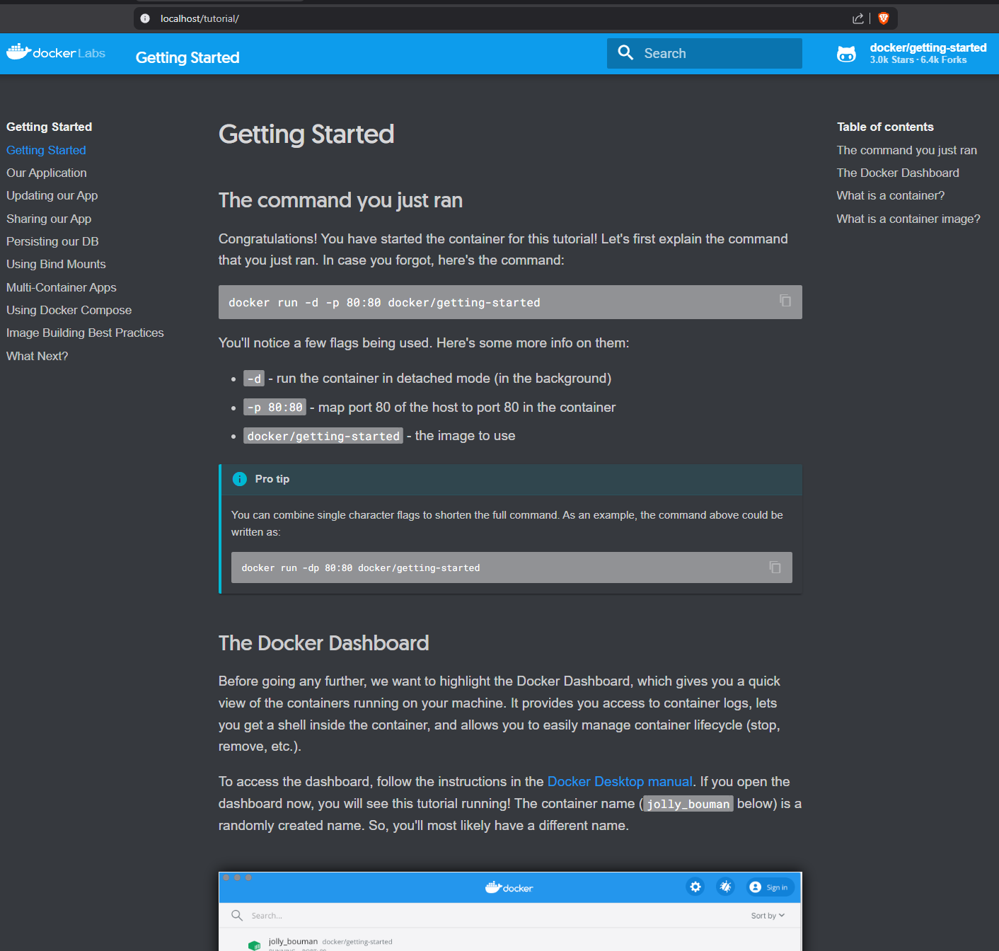
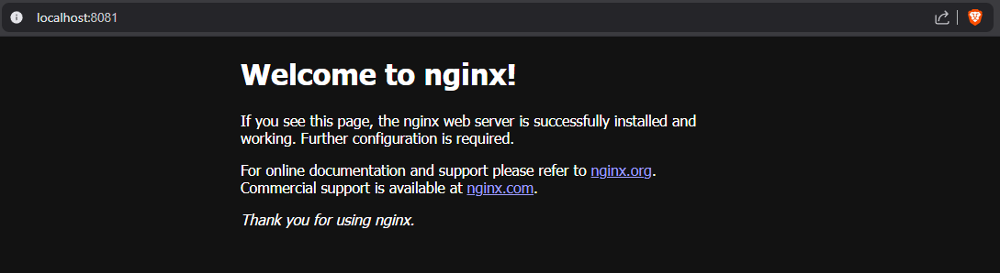
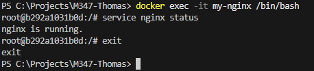
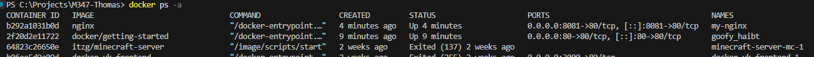
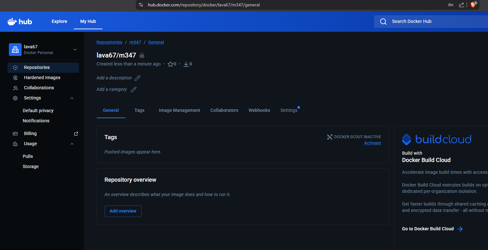
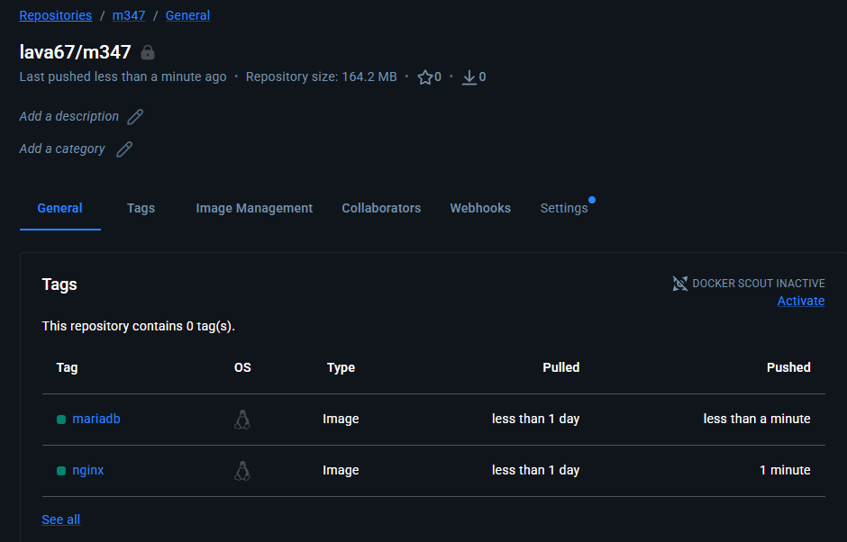

# KN01: Docker Grundlagen

## A) Installation

### Beschreibung
<!-- Hier beschreiben, was gemacht wurde -->

### Screenshots
**Webseite nach Start des Containers:**

**Container in Docker Desktop:**

## B) Docker CLI

### 1. Docker Version
Befehl: `docker --version`
Output: `Docker version 29.1.3, build f528148`

### 2. Docker Search
Befehle:
- `docker search ubuntu`
- `docker search nginx`

### 3. Erklärung `docker run`
Der Befehl `docker run -d -p 80:80 docker/getting-started` startet einen neuen Container aus dem Image `docker/getting-started`.
- `-d` (detached): Der Container läuft im Hintergrund.
- `-p 80:80` (publish): Der Port 80 des Hosts wird auf den Port 80 des Containers gemappt.
- `docker/getting-started`: Der Name des Images, das verwendet werden soll.

### 4. Nginx Container
Wir laden das Image und starten den Container manuell:
1. `docker pull nginx`: Lädt das Image herunter.
2. `docker create --name my-nginx -p 8081:80 nginx`: Erstellt den Container, mappt Port 8081 auf 80.
3. `docker start my-nginx`: Startet den erstellten Container.

**Screenshot Nginx Standard-Seite:**

### 5. Ubuntu Container

**5.1 `docker run -d ubuntu`**
Der Befehl `docker run -d ubuntu` startet einen Container im Hintergrund. 
- **Das Problem**: Da das Ubuntu-Image standardmässig keinen langlaufenden Prozess (wie einen Webserver) startet, beendet sich der Container sofort nach dem Start wieder. Er führt nur kurz "nichts" aus und stoppt dann mit Exit Code 0.
- Das Image wurde (falls nicht vorhanden) automatisch heruntergeladen.
- Der Container konnte technisch starten, hat aber keine Aufgabe und beendet sich daher sofort.

**5.2 `docker run -it ubuntu`**
Der Befehl `docker run -it ubuntu` startet den Container im interaktiven Modus.
- `-i` (interactive): Hält STDIN offen.
- `-t` (tty): Allociert ein Pseudo-TTY.
- **Ergebnis**: Man landet direkt in der Shell innerhalb des Containers und kann Befehle ausführen. Wenn man `exit` eingibt, stoppt der Container.

### 6. Nginx Interaktiv
Um in einen *laufenden* Container (wie unseren `my-nginx`) hineinzugehen, nutzen wir `docker exec`.
Befehl: `docker exec -it my-nginx /bin/bash`
In der Shell führen wir dann aus: `service nginx status`

**Screenshot Service Status:**

### 7. Container Status
Befehl: `docker ps -a`

**Screenshot Container Übersicht:**

### 8-10. Aufräumen
Wir stoppen und löschen die Container und entfernen die Images.
Befehle:
- `docker stop my-nginx`
- `docker rm my-nginx`
- `docker rm goofy_haibt`
- `docker rmi nginx`
- `docker rmi docker/getting-started`

## C) Registry und Repository

### Repository Erstellung
<!-- Beschreibung -->

**Screenshot leeres Repository:**

## D) Privates Repository

### Tagging und Push
Wir verwenden den Benutzernamen `lava67`.

**1. Taggen**
Befehl: `docker tag nginx:latest lava67/m347:nginx`
- **Erklärung**: `docker tag` erstellt einen Alias für ein Image. Wir nehmen das lokale `nginx:latest` und geben ihm einen neuen Namen, der auf unser Repository (`lava67/m347`) zeigt. Der Teil hinter dem Doppelpunkt (`:nginx`) ist der Tag.

**2. Pushen**
Befehl: `docker push lava67/m347:nginx`
- **Erklärung**: `docker push` lädt das Image in das angegebene Repository auf Docker Hub hoch. Da wir eingeloggt sind, haben wir die Berechtigung dazu.

### MariaDB
Wir machen dasselbe für `mariadb`.
Befehle:
- `docker pull mariadb`
- `docker tag mariadb:latest lava67/m347:mariadb`
- `docker push lava67/m347:mariadb`

**Screenshot Tags im Docker Hub:**

