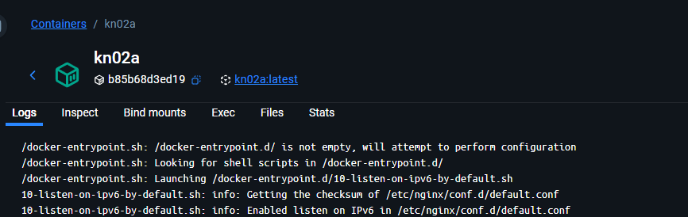
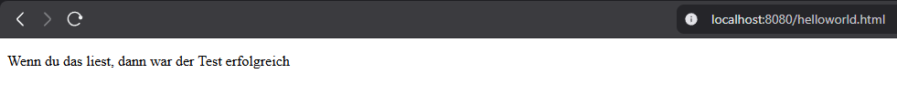
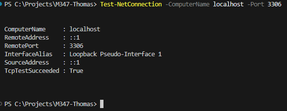
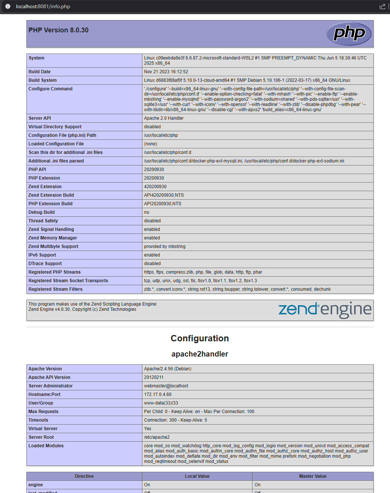
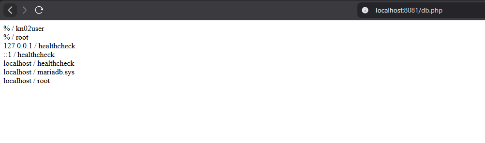

# KN02: Containerisierung einer Applikation

## A) Dockerfile I (Nginx)

### Beschreibung
Ich habe ein Dockerfile erstellt, das auf dem `nginx` Image basiert.
Dabei habe ich das Arbeitsverzeichnis auf `/usr/share/nginx/html` gesetzt und die Datei `helloworld.html` dort hinein kopiert.

**Dockerfile Erklärung:**
- `FROM nginx`: Basis-Image ist der offizielle Nginx-Server.
- `WORKDIR /usr/share/nginx/html`: Setzt das Arbeitsverzeichnis für folgende Befehle.
- `COPY helloworld.html .`: Kopiert die lokale `helloworld.html` in das Arbeitsverzeichnis im Container.
- `EXPOSE 80`: Dokumentiert, dass der Container auf Port 80 lauscht.

### Befehle
- Build: `docker build -t kn02a .`
- Run: `docker run -d -p 8080:80 --name kn02a kn02a`

### Screenshots

**Docker Desktop (Images tab showing kn02a):**

**Browser (helloworld.html):**

---

## B) Dockerfile II (PHP & MariaDB)

### Beschreibung
Für diesen Teil habe ich zwei Container erstellt:
1.  **Dankenbank (MariaDB)**: Basiert auf `mariadb`. Die Credentials (User, Passwort, Datenbank) wurden direkt im Dockerfile mittels `ENV` gesetzt.
2.  **Webserver (PHP)**: Basiert auf `php:8.0-apache`. Ich habe die `mysqli` Extension installiert und die Dateien `info.php` und `db.php` hineinkopiert.

Die Verbindung zwischen den Containern habe ich über den `--link` Parameter hergestellt, sodass der Web-Container auf den DB-Container unter dem Hostnamen `kn02b-db` zugreifen kann.

### Befehle (Datenbank)
- Build: `docker build -f Dockerfile.db -t kn02b-db .`
- Run: `docker run -d -p 3306:3306 --name kn02b-db kn02b-db`
- Test (PowerShell): `Test-NetConnection -ComputerName localhost -Port 3306`

### Befehle (Webserver)
- Build: `docker build -f Dockerfile.web -t kn02b-web .`
- Run: `docker run -d -p 8081:80 --name kn02b-web --link kn02b-db:kn02b-db kn02b-web`

### Screenshots

**Datenbank Verbindungstest (PowerShell):**

**Browser (info.php):**

**Browser (db.php Verbindung erfolgreich):**

