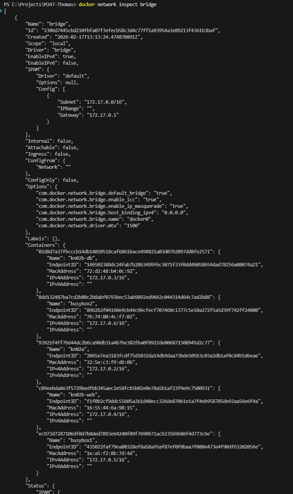
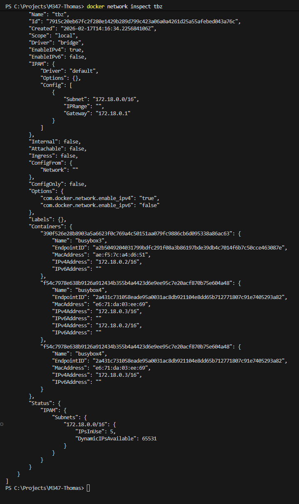
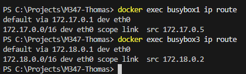

# KN03: Netzwerk, Sicherheit

## A) Eigenes Netzwerk

### Netzwerke erstellen und Container starten

Folgende Befehle wurden ausgeführt, um das Netzwerk `tbz` und die Container zu erstellen:

```bash
# Netzwerk erstellen
docker network create --subnet 172.18.0.0/16 tbz

# Container im default bridge Netzwerk starten
docker run -dit --name busybox1 busybox
docker run -dit --name busybox2 busybox

# Container im tbz Netzwerk mit statischen IPs starten
docker run -dit --name busybox3 --network tbz --ip 172.18.0.2 busybox
docker run -dit --name busybox4 --network tbz --ip 172.18.0.3 busybox
```

### Inspektion

Die IP-Adressen der Container sind wie folgt verteilt:

- **busybox1**: `172.17.0.5` (Bridge)
- **busybox2**: `172.17.0.6` (Bridge)
- **busybox3**: `172.18.0.2` (tbz)
- **busybox4**: `172.18.0.3` (tbz)

Screenshots der `docker network inspect` Befehle:



### Connectivity Tests

Wir testen die Verbindung zwischen den Containern mittels Ping.

**Erwartung:**
- Im **default bridge** Netzwerk (`busybox1`, `busybox2`) funktioniert die Namensauflösung (DNS) **nicht** standardmäßig. Ein Ping auf den Namen `busybox2` schlägt fehl ("bad address"). Ein Ping auf die IP-Adresse (`172.17.0.6`) sollte jedoch funktionieren.
- Im **user-defined** Netzwerk `tbz` (`busybox3`, `busybox4`) funktioniert die Namensauflösung automatisch. `busybox3` kann `busybox4` anpingen.
- Container in unterschiedlichen Netzwerken (`busybox1` <-> `busybox3`) können sich weder per Name noch per IP erreichen.

Befehle für die Tests:
```bash
# Test 1: busybox1 -> busybox2 (Name) - ERWARTET: nicht erfolgreich
docker exec -it busybox1 ping -c 3 busybox2

# Test 2: busybox1 -> busybox2 (IP) - ERWARTET: erfolgreich
docker exec -it busybox1 ping -c 3 172.17.0.6

# Test 3: busybox1 -> busybox3 (Name) - ERWARTET: nicht erfolgreich
docker exec -it busybox1 ping -c 3 busybox3

# Test 4: busybox3 -> busybox4 (Name) - ERWARTET: erfolgreich
docker exec -it busybox3 ping -c 3 busybox4

# Test 5: busybox3 -> busybox1 (Name) - ERWARTET: nicht erfolgreich
docker exec -it busybox3 ping -c 3 busybox1
```

Screenshots der Ping-Resultate:



### Fragen & Antworten

1. **Welche IP-Adressen haben busybox1, busybox2, busybox3 und busybox4 erhalten?**
   - busybox1: 172.17.0.5
   - busybox2: 172.17.0.6
   - busybox3: 172.18.0.2
   - busybox4: 172.18.0.3

2. **Starten Sie eine interaktive Session auf busybox1**
   Um den Gateway zu prüfen:
   ```bash
   docker exec busybox1 ip route
   ```
   - Welcher Default-Gateway ist eingetragen? `172.17.0.1`
   - Welcher Container hat den gleichen? `busybox2`

3. **Starten Sie eine interaktive Session auf busybox3**
   Um den Gateway zu prüfen:
   ```bash
   docker exec busybox3 ip route
   ```
   - Welcher Default-Gateway ist eingetragen? `172.18.0.1` (für das 172.18.0.0/16 Netz)
   - Welcher Container hat den gleichen? `busybox4`

Screenshots der Gateway-Prüfung (`ip route`):



4. **Vergleich KN02**
   - In welchem Netzwerk befanden sich die beiden Container? `default bridge`
   - Wieso konnten die miteinander reden?
     In KN02 haben wir `--link` verwendet (oder sie waren im selben Netz und wir haben per IP kommuniziert - aber `--link` ermöglicht Namensauflösung im default bridge network). Ohne `--link` geht im default bridge network nur Kommunikation per IP, nicht per DNS-Name. In user-defined Networks (wie `tbz`) geht DNS automatisch.
