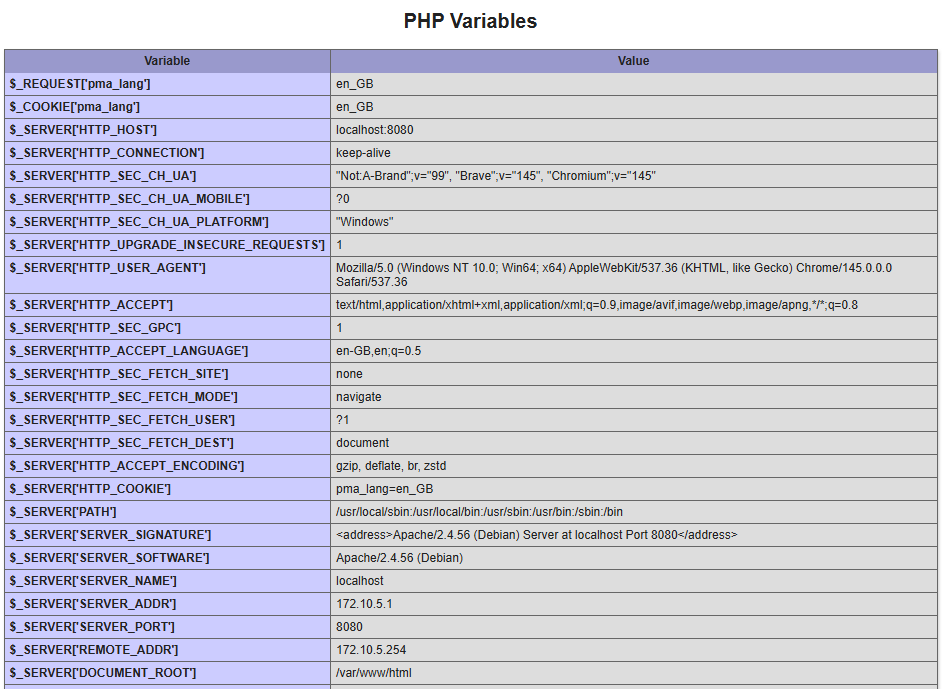
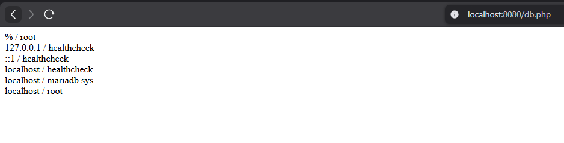
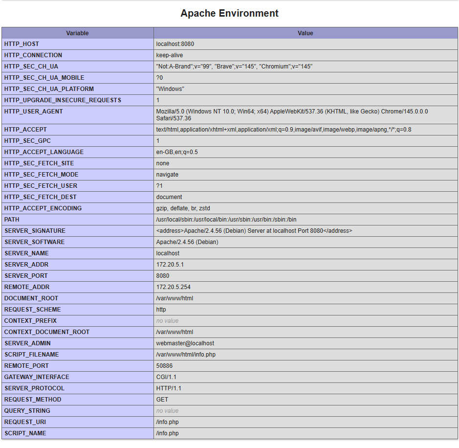
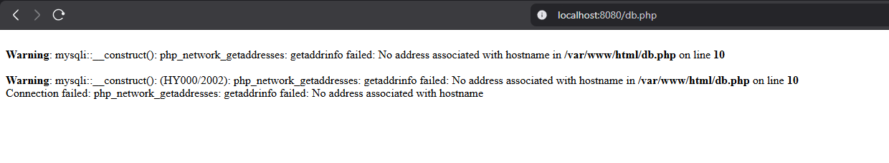
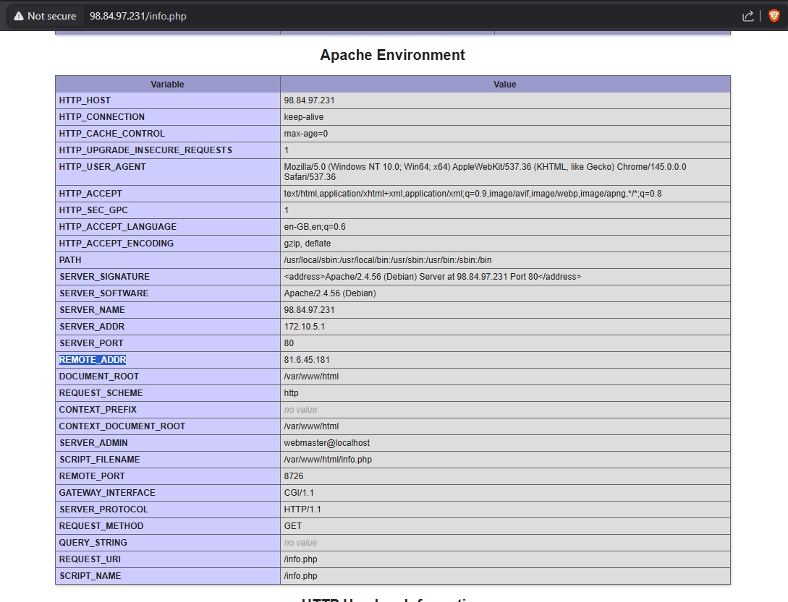
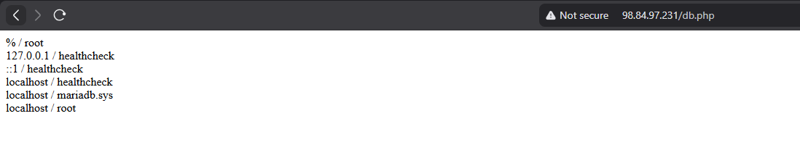

# KN04: Docker Compose

## A) Docker Compose: Lokal

### Teil a) Verwendung von Original Images

In diesem Teil wurde eine `docker-compose.yaml` Datei erstellt, die eine MariaDB-Datenbank (Original Image) und einen Webserver (eigenes Dockerfile) startet.

#### Verwendete Dateien
- [docker-compose.yaml](KN04-A/docker-compose.yaml)
- [Dockerfile](KN04-A/Dockerfile)

#### Screenshots
**info.php (Lokaler Webserver mit IPs):**

**db.php (Verbindung zur Datenbank):**

#### Docker Compose Up Befehle
Der Befehl `docker compose up` ist eine Kombination aus mehreren Docker-Befehlen, die nacheinander ausgeführt werden, um die Umgebung zu starten. Er führt folgende Befehle (oder deren Funktionalität) aus:

1.  **`docker compose build`**: Baut die Images für die Services, bei denen ein `build`-Kontext angegeben ist (falls die Images noch nicht existieren oder `--build` verwendet wird).
2.  **`docker compose pull`**: Lädt die benötigten Images von der Registry herunter (z.B. Docker Hub), falls diese nicht lokal vorhanden sind.
3.  **`docker compose create`**: Erstellt die Container basierend auf der Konfiguration in der YAML-Datei.
4.  **`docker compose start`**: Startet die bereits erstellten Container.
5.  **Netzwerk & Volumes**: Erstellt im Hintergrund auch die notwendigen Netzwerke (`docker network create`) und Volumes (`docker volume create`).

### Teil b) Verwendung Ihrer eigenen Images

In diesem Teil wurden die bereits publizierten Images verwendet. Der IP-Bereich wurde auf `172.20.0.0/16` geändert.

#### Dateien
- [docker-compose.own.yaml](KN04-A/docker-compose.own.yaml)

#### Screenshots
**info.php (Eigene Images, neuer IP-Range):**

**db.php (Fehlermeldung):**

#### Erklärung des Fehlers
Der Fehler `php_network_getaddresses: getaddrinfo failed` tritt auf, weil der im PHP-Script `db.php` hinterlegte Hostname (`m347-kn04a-db`) nicht aufgelöst werden kann.
Da das Image `lava67/m347:kn02b-web` bereits die Dateien aus KN02 enthält, ist das darin enthaltene `db.php` statisch. Wenn dieses Script einen Hostnamen erwartet, der in der neuen Docker Compose Umgebung nicht existiert oder nicht aufgelöst werden kann (z.B. weil der Service-Name anders ist), schlägt die Namensauflösung fehl.

**Lösung:**
Man kann das Problem lösen, indem man:
1. Den Service-Namen in der `docker-compose.own.yaml` exakt so benennt, wie es das PHP-Script erwartet.
2. Ein Volume verwendet, um die `db.php` mit einer korrekten Version zu überschreiben.
3. Den Container-Namen (Hostname) explizit im Compose-File setzt.

## Docker Desktop: Konfiguration (Windows)

Für die Ausführung auf Windows mit Docker Desktop sind folgende Punkte zu beachten:
- **Backend:** Es wird empfohlen, das **WSL 2 Backend** zu verwenden.
- **WSL Integration:** In den Einstellungen von Docker Desktop unter *Resources > WSL Integration* muss die Integration für die verwendete Linux-Distribution (z.B. Ubuntu) aktiviert sein.
- **Berechtigungen:** Falls Berechtigungsfehler auftreten, sollte der Benutzer zur Gruppe `docker-users` hinzugefügt werden.

## B) Docker Compose: Cloud

*Die Cloud-Implementierung erfolgt über ein Cloud-Init Skript.*

#### Cloud-Init Datei
- [docker-cloud-init.yaml](docker-cloud-init.yaml)

#### Screenshots der Cloud-Instanz
**info.php (Cloud):**

**db.php (Cloud):**

