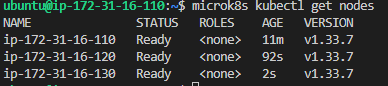
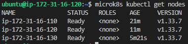
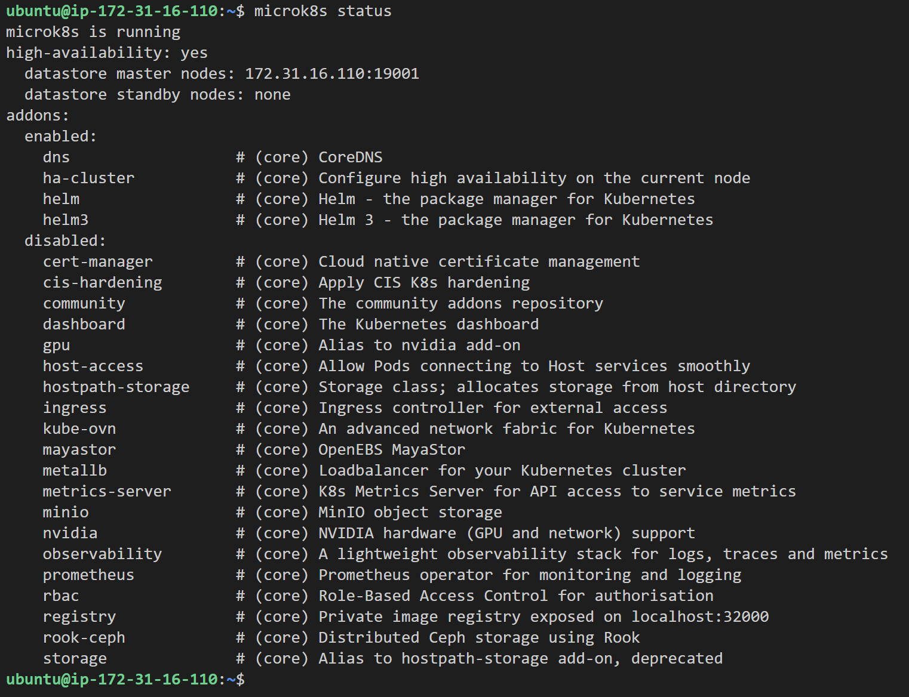
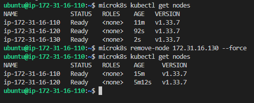
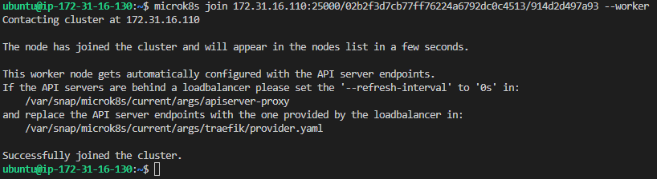
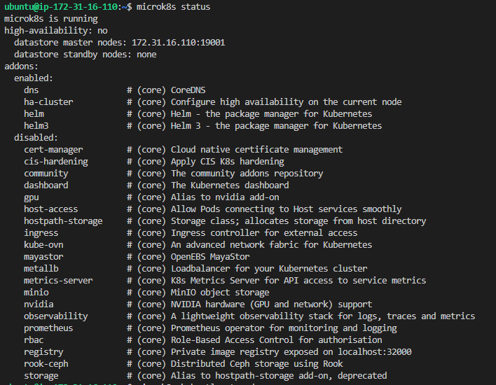
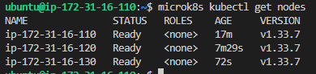
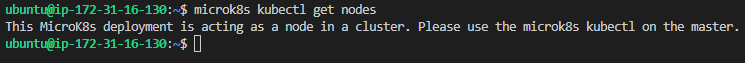

# KN06: Kubernetes I

## A) Installation

Ich habe drei EC2-Instanzen (t2.medium, Ubuntu 22.04) auf AWS erstellt und MicroK8s via Cloud-Init installiert. Danach habe ich die drei Nodes zu einem Cluster zusammengeführt.

### Cluster mit drei Nodes

Der Befehl `microk8s kubectl get nodes` zeigt, dass alle drei Nodes im Status "Ready" sind:

---

## B) Verständnis für Cluster

### Unterschied zwischen `microk8s` und `microk8s kubectl`

- **`microk8s`**: Verwaltet die MicroK8s-Installation selbst (z.B. `microk8s status`, `microk8s add-node`, `microk8s leave`). Es steuert den Cluster auf Node-Ebene — Nodes hinzufügen, entfernen, Addons aktivieren, etc.
- **`microk8s kubectl`**: Ist das Kubernetes-Kommandozeilentool (`kubectl`), das innerhalb von MicroK8s läuft. Damit verwaltet man Kubernetes-Ressourcen wie Pods, Services, Deployments, etc.

Kurz gesagt: `microk8s` = Cluster-Verwaltung, `microk8s kubectl` = Kubernetes-Ressourcen-Verwaltung.

---

### `kubectl get nodes` auf einem zweiten Node

Der gleiche Befehl auf Node 2 zeigt dasselbe Ergebnis — alle drei Nodes sind sichtbar, da sie alle Master-Nodes (Control Plane) sind:

---

### `microk8s status` — Analyse der High Availability (HA)

Dieser Screenshot zeigt den initialen Zustand des Clusters mit drei voll funktionsfähigen Nodes:

**Bedeutung der Anzeige:**

- **high-availability: yes**: Dies signalisiert, dass der Cluster den HA-Status erreicht hat. Gemäss der Dokumentation (Kapitel *High Availability*) schaltet MicroK8s automatisch in diesen Modus, sobald mindestens drei Nodes dem Cluster beitreten.
- **datastore master nodes**: Hier werden die Nodes aufgelistet, die aktiv an der **Dqlite** (Distributed SQLite) Datenbank teilnehmen. In einem 3-Node-Cluster fungieren alle drei Nodes als "Voter" und halten eine replizierte Kopie des Cluster-Zustands.
- **Funktionsweise**: Durch die drei Master-Nodes ist der Cluster redundant. Da für Entscheidungen ein Quorum (Mehrheit) benötigt wird, bleibt der Cluster selbst beim Ausfall eines beliebigen Nodes voll funktionsfähig.

---

### Node entfernen

Ich habe Node 3 (172.31.16.130) aus dem Cluster entfernt. Der Screenshot zeigt:
1. Den Zustand vor dem Entfernen (3 Nodes)
2. Den Befehl `microk8s remove-node 172.31.16.130 --force`
3. Danach nur noch 2 Nodes im Cluster

---

### Node als Worker wieder hinzufügen

Node 3 wurde mit dem `--worker` Flag dem Cluster wieder hinzugefügt. Ein Worker führt keine Control-Plane-Komponenten aus, sondern nur Workloads (Pods):

---

### `microk8s status` — Nach dem Hinzufügen als Worker

Nach dem Hinzufügen von Node 3 als Worker zeigt `microk8s status`:
- **high-availability: no** — Der Cluster ist nicht mehr hochverfügbar, da nur noch 1 Master-Node mit Datenbank vorhanden ist (Node 2 ist Master, Node 3 ist Worker).
- **datastore master nodes**: Nur noch eine IP (172.31.16.110).
- **datastore standby nodes**: none.

Der Unterschied kommt daher, dass ein Worker-Node keinen Zugriff auf die Datenbank (Dqlite) hat und somit nicht als "Voter" zählt. Für HA werden mindestens 3 Voter benötigt.

---

### `kubectl get nodes` — Master vs. Worker

**Auf dem Master-Node:**

Der Master sieht alle Nodes im Cluster:

**Auf dem Worker-Node:**

Der Worker kann `kubectl get nodes` nicht ausführen, da er keinen Zugriff auf die Kubernetes-API hat. Dies stimmt mit dem Ergebnis von `microk8s status` überein — der Worker hat keine Control-Plane-Komponenten:

Dies erklärt auch, warum `microk8s status` den Worker als "standby" anzeigt: Er führt nur Workloads aus, hat aber keinen Zugriff auf die Cluster-Verwaltung.
