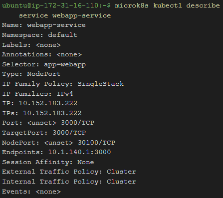
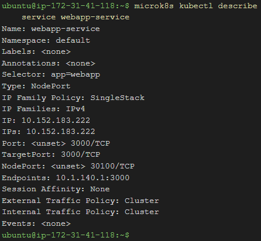
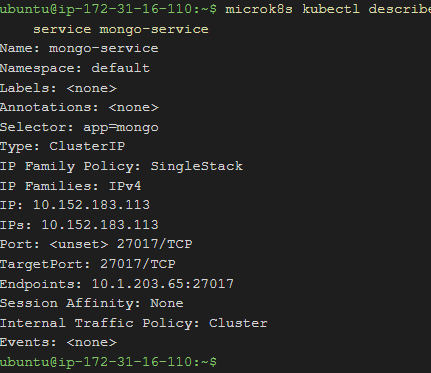
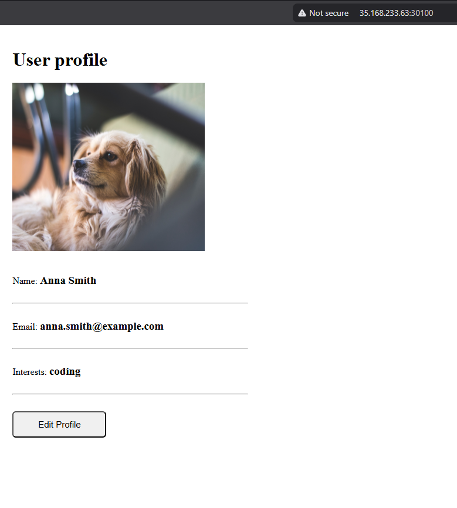
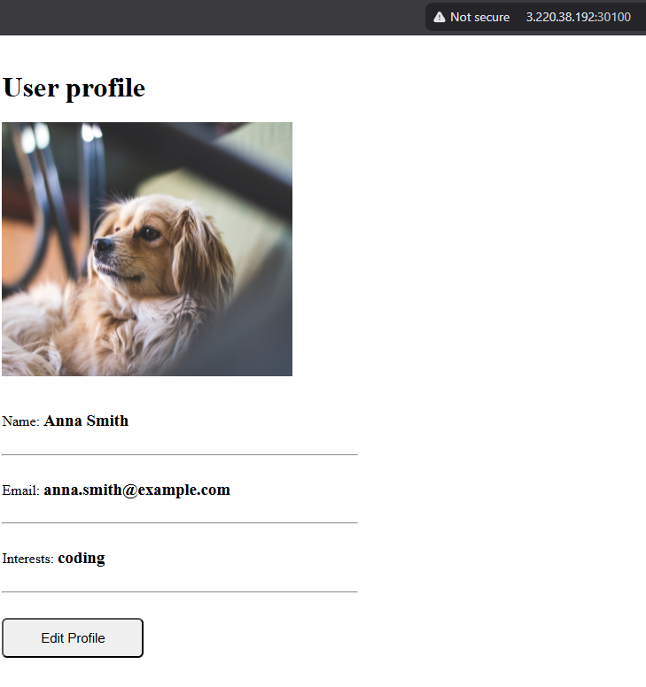
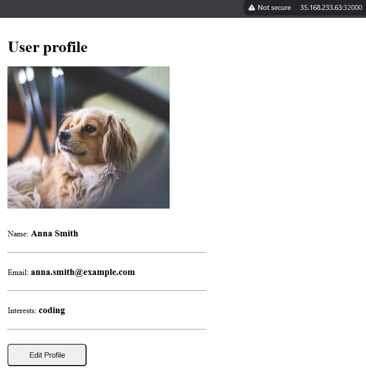
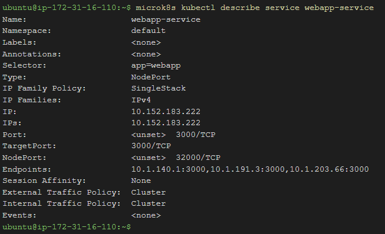

# KN07 Kubernetes II

## A) Begriffe und Konzepte erlernen

1. **Unterschied zwischen *Pods* und *Replicas*:**
   Ein Pod ist die kleinste Deploymenteinheit in Kubernetes und stellt typischerweise eine Instanz einer laufenden Applikation (z.B. in einem Docker-Container) dar. Pods teilen sich Speichervolumes und eine IP-Adresse. Ein Replica ist im Prinzip eine identische Kopie eines Pods. Durch das Definieren von mehreren Replicas laufen mehrere Kopien der gleichen Applikation gleichzeitig. Dies dient der Skalierbarkeit (Lastverteilung) und Ausfallsicherheit, falls ein einzelner Pod ausfallen sollte.

2. **Unterschied zwischen *Service* und *Deployment*:**
   Ein **Deployment** ist verantwortlich für das Verwalten der Pods. Es stellt sicher, dass immer genau die gewünschte Anzahl an Pods (Replicas) läuft, auch wenn Node-Ausfälle auftreten. Es definiert den "Soll-Zustand" der Applikation.
   Ein **Service** ist eine abstrakte Netzwerkschicht, die einen permanenten, konstanten Zugangspunkt (IP oder DNS-Name) für eine Gruppe von Pods bereitstellt. Da Deployments die Pods jederzeit neu erstellen können (wodurch sich deren IPs ändern), leitet der Service einkommenden Traffic verlässlich an die aktuell laufenden Pods weiter.

3. **Welches Problem löst *Ingress*?**
   Ein Ingress löst das Problem des externen Netzwerkzugriffs in den Cluster. Anstatt für jeden einzelnen Service einen eigenen externen LoadBalancer oder NodePort mit verschiedenen, schwer merkbaren Ports zu erstellen, bietet Ingress einen einzelnen zentralen Eintrittspunkt (meist HTTP Port 80 und HTTPS Port 443). Ingress wertet die angefragte Domain oder den URL-Pfad aus und leitet den Traffic gemäss definierten Routing-Regeln an den entsprechenden internen Service weiter.

4. **Für was ist ein *statefulset*? (Beispiel, keine Datenbank)**
   Ein StatefulSet verhält sich ähnlich wie ein Deployment, vergibt den Pods jedoch eine anhaltende und berechenbare "Identität" (z.B. `app-0`, `app-1` statt zufälliger Hash-Namen) und bindet diese an bestimmte, persistente Speicher. Dies ist essenziell für *stateful* Applikationen, bei denen die Reihenfolge beim Starten, das Behalten derselben Identität und der Erhalt des Datenspeichers nach einem Neustart absolut erforderlich sind.
   *Beispiel*: Eine Message-Broker Infrastruktur wie **Apache Kafka** oder **RabbitMQ**. Diese Tools benötigen stabile Netzwerkidentitäten und lokalen Storage für Persistenz der Queues/Topics.

## B) Demo Projekt

### 1. Konzeptuelle Abweichung im Tutorial
Die MongoDB-Datenbank wurde in diesem Projekt bloss als standardmässiges *Deployment* anstatt des empfohlenen *StatefulSets* umgesetzt. 
**Begründung:** Für dieses kurze Demo-Projekt ist dies ausreichend, da keine persistenten Storage-Volumes (wie in einer echten Datenbank-Umgebung erforderlich) eingerichtet werden. Alle hier gespeicherten Daten würden bei einem fehlerbedingten Neustart des Datenbank-Pods wieder gelöscht werden. Für produktive, dauerhafte Datenhaltung müsste eine Datenbank immer mit einem StatefulSet plus angebundenem persistenten Volume realisiert werden.

### 2. Die *MongoUrl* Definition
Die in der `mongo-config.yaml` festgelegte MongoUrl lautet `mongo-service`. 
**Erklärung:** Dieser Wert ist absolut korrekt, weil Kubernetes über einen internen DNS-Server (CoreDNS) verfügt. Wenn der Webapp-Pod versucht, sich mit der Adresse `mongo-service` zu verbinden, löst Kubernetes diesen Namen automatisch in die gerade aktuelle, interne virtuelle IP (ClusterIP) des MongoDB-Services auf. 

### 3. Service Webapp
*(Screenshots befinden sich im Unterordner `images`)*

### 4. Unterschiede in der Service-Ausgabe (`mongo-service` vs `webapp-service`)

**Erklärung:** 
Der grösste Unterschied zwischen den beiden Services ist der definierte `Type` und die Ports.
Der `mongo-service` hat den Typ `ClusterIP`. Das bedeutet, die Datenbank ist *ausschliesslich* aus dem internen Cluster-Netzwerk heraus (auf Port 27017) erreichbar, nicht aber von aussen. Der `webapp-service` ist jedoch vom Typ `NodePort`. Er erzeugt nicht nur einen internen Port (3000), sondern stellt den Dienst nach aussen über den sogenannten NodePort `30100` auf **allen** physikalischen Nodes des Clusters zur Verfügung.

### 5. Web-App Aufrufen

**Erklärung:**
Um die Webseite im Browser aufzurufen, musste ich jeweils die Public IP der AWS EC2-Instanz, gefolgt von einem Doppelpunkt und dem definierten NodePort (`30100`) tippen (Bsp. `http://35.168.233.63:30100` und `http://3.220.38.192:30100`). Obwohl der Pod womöglich nur auf einem bestimmten Node läuft, nimmt Kubernetes (über `kube-proxy`) auf jedem beliebigen Node die Anfragen entgegen und routet sie automatisch intern an die Webapp weiter.

### 6. MongoDB Compass Verbindung
*(Fehlgeschlagener Verbindungsversuch von aussen)*
**Begründung:**
Man versucht von aussen über das Internet auf die Datenbank zuzugreifen. Dies schlägt fehl, weil der `mongo-service` – wie zuvor erwähnt – vom Typ `ClusterIP` ist. Er ist nach aussen hin komplett abgeschirmt.
Um den Zugriff über MongoDB Compass vom privaten Computer zu ermöglichen, müsste man bei der Service-Definition (`mongo.yaml`) den Service Type auf `LoadBalancer` oder `NodePort` ändern, damit ein externer Port geöffnet wird.

### 7. Update der Webapp
**Erklärung der Schritte:**
Ich habe die Datei `webapp.yaml` via Editor (z.B. Nano) abgeändert:
1. Unter `spec.replicas` bei Deployment wurde die Zahl von `1` auf `3` geändert.
2. Unter `spec.ports` beim Service wurde der `nodePort` von `30100` auf `32000` geändert.
3. Die Änderung wurde mit `microk8s kubectl apply -f webapp.yaml` angewendet. Kubernetes aktualisiert dann das bestehende Deployment und den Service, spawnt zwei zusätzliche neue Pods und ändert den freigegebenen NodePort im System.

**Erklärung Endpoints:**
Beim `microk8s kubectl describe service webapp-service` ist jetzt ersichtlich, dass unter der Eigenschaft `Endpoints` drei verschiedene interne IP-Adressen aufgelistet sind anstatt nur einer. Das ist der ersichtliche Unterschied und bedeutet, dass der Service nun im Round-Robin-Verfahren Requests an alle 3 laufenden Replicas weitergibt.

---
*Die oben referenzierten Bilder für diesen Beleg finden Sie im entsprechenden `images` Verzeichnis.*
