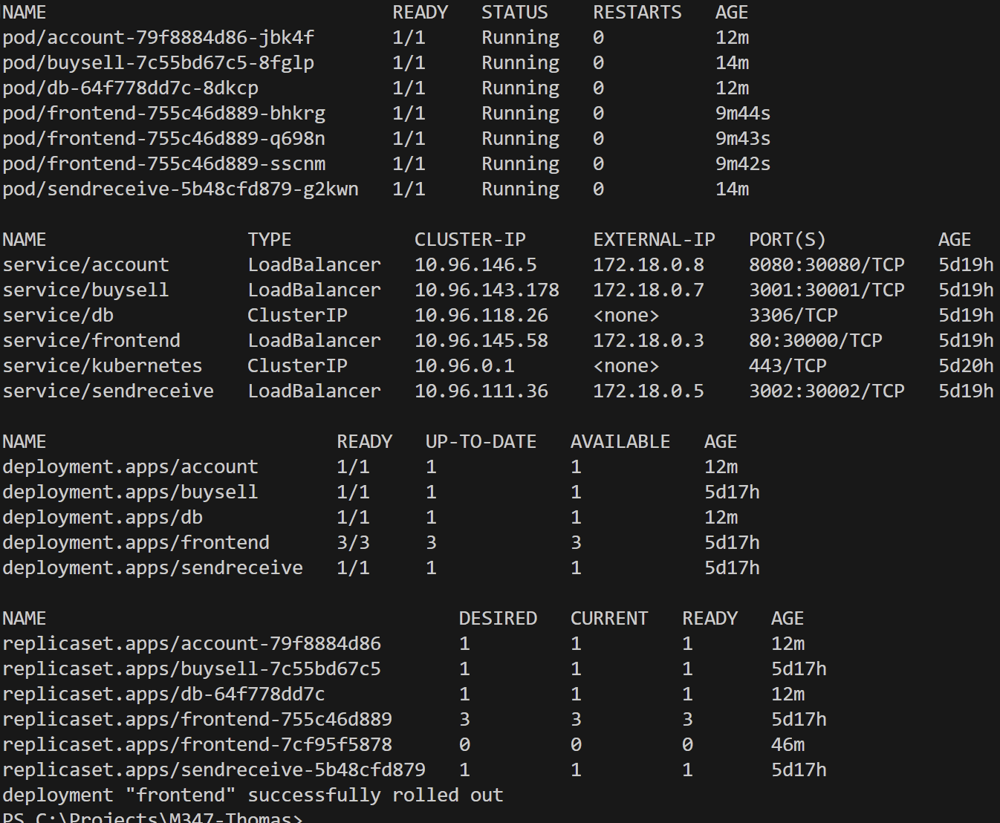
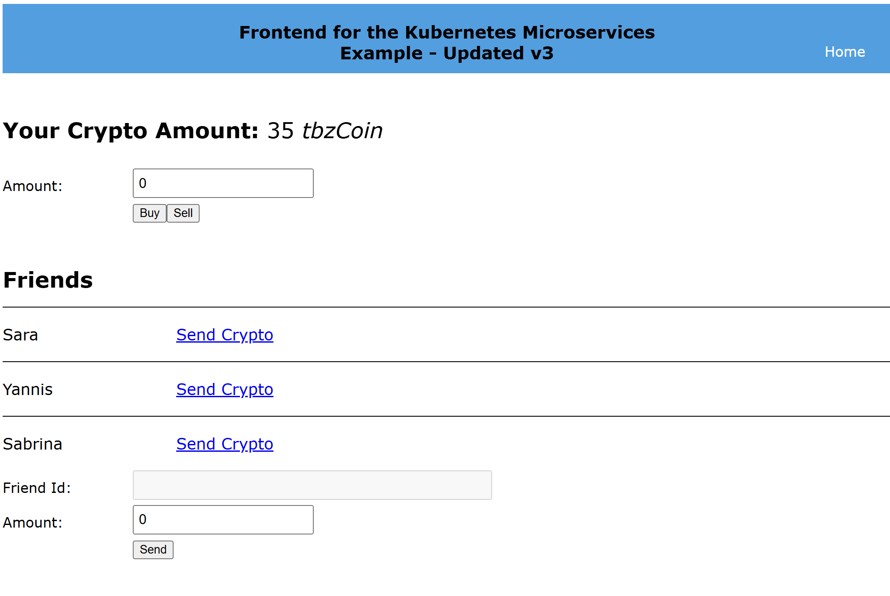

# KN08 Kubernetes III - Microservices

In diesem Modul wurde eine Microservice-Architektur entworfen, containerisiert und in einem Kubernetes-Cluster orchestriert. Der Fokus lag auf der Interoperabilität zwischen verschiedenen Services, dem Management von Konfigurationen über Kubernetes-Objekte sowie der Durchführung von unterbrechungsfreien Updates in einer AWS-Umgebung.

## A) Microservice-Architektur

Die Applikation besteht aus fünf funktionalen Komponenten:

1.  **Frontend (UI)**: React-basierte Weboberfläche zur Verwaltung von tbzCoins.
2.  **Account (DB-Gateway)**: Zentraler Service für Kontostände und Freundeslisten. Nur dieser Service hat direkten Zugriff auf die MySQL-Datenbank.
3.  **BuySell**: Ermöglicht den Kauf und Verkauf von Kryptos durch Interaktion mit dem Account-Service.
4.  **SendReceive**: Ermöglicht den Transfer von Kryptos zwischen Freunden via Account-Service.
5.  **Datenbank (DB)**: MySQL-Instanz zur persistenten Speicherung der Daten.

### Kommunikation
Die Services kommunizieren über **HTTP/REST**. Während das Frontend für den Benutzer die zentrale Anlaufstelle bietet, agiert der **Account Service** intern als Shared-Resource-Provider für die Transaktionslogik von `BuySell` und `SendReceive`.

---

## B) Realisierung & Umsetzung

### 1. Containerisierung (Multistage Dockerfiles)
Um die Image-Grösse zu minimieren und die Sicherheit zu erhöhen, wurden für die Applikation **Multistage Dockerfiles** eingesetzt:
- **Build-Stage**: Abhängigkeiten installieren und Applikation kompilieren (Node.js).
- **Run-Stage**: Nur die notwendigen Artefakte (z.B. der `build`-Folder) in ein schlankes Basis-Image (Alpine) kopieren.

> [!TIP]
> Das Frontend nutzt ein `env.sh` Script, um Kubernetes-ConfigMap Variablen zur Laufzeit in die statischen Files einzubetten. Dies ermöglicht "Build once, run anywhere".

### 2. Kubernetes Objekte
Die Bereitstellung erfolgte mittels standardisierter YAML-Manifeste:
- **Deployments**: Verwalten die Replicas der Pods (3 Replicas für das Frontend für Hochverfügbarkeit).
- **Services (LoadBalancer)**: Alle Services wurden als `type: LoadBalancer` konfiguriert. Das Frontend ist zusätzlich über einen AWS NLB erreichbar.
- **ConfigMap & Secrets**: Zentrale Verwaltung von DB-Verbindungsdaten und API-URLs.

### 3. Proof of Operation
Die folgende Abbildung zeigt die erfolgreich gestartete Infrastruktur im Kubernetes-Cluster:

---

## C) Erweiterte Features

### 1. Zero-Downtime Update (Rolling Update)
In Schritt 8 wurde ein Software-Update simuliert (Wechsel auf Frontend `v4`). Kubernetes führt hierbei ein **Rolling Update** durch:

1. Neue Pods werden mit dem neuen Image gestartet.
2. Erst wenn die neuen Pods "Ready" sind, werden die alten Pods terminiert.
3. Der Benutzer bemerkt keinerlei Unterbruch (Downtime).

### 2. Load Balancing (AWS NLB)
Durch die Definition von mehreren Replicas und einem Service vom Typ `LoadBalancer` (mit NLB Annotationen) verteilt AWS die Last automatisch auf alle verfügbaren Pods. 

---

## D) Verifikation & Testen

Um die Applikation zu testen, folgen Sie diesen Schritten:

1. **URL aufrufen**: Navigieren Sie zu [http://54.175.15.144](http://54.175.15.144).
2. **Login**: Nutzen Sie einen der Test-Accounts (z.B. ID 1).
3. **Transaktion**: Führen Sie einen "Kauf" oder "Transfer" durch.
4. **Validierung**: Prüfen Sie, ob der Kontostand unmittelbar aktualisiert wird (Kommunikation via Account-Service zur DB).

> [!IMPORTANT]
> Die vollständigen Konfigurationsdateien befinden sich im Verzeichnis `crypto-app/k8s/`. Der Remote-Zugriff erfolgt über die beiliegende `k3s.yaml`.
